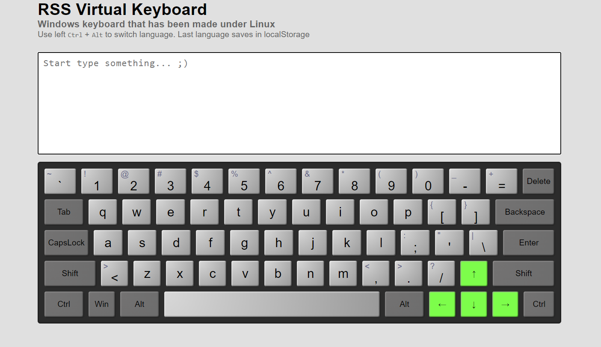

### Virtual-keyboard

<strong>Tools:</strong> pure HTML and CSS, Vanilla JS, CSS-Flexbox, CSS-Variables, JS-Classes, JS-Destructuring

The index.html file is empty, all elements are generated via JavaScript. The keyboard consists: alphanumeric keys (A-Z, 0-9), constrol keys (Shift, Ctrl, Alt, Caps Lock), Enter and editing keys (Del and Backspase), navigation keys (four arrows). 
The keyboard responds to keystrokes on both real keyboards and virtual ones (that is with the mouse). In all cases they are accompanied by the animation of a key being pressed.

You can find the code <a href="https://github.com/confesssa/virtual-keyboard">here</a>. Deploy is <a href="https://confesssa.github.io/virtual-keyboard/?target=_blank">here</a> or you can click on the image below.

